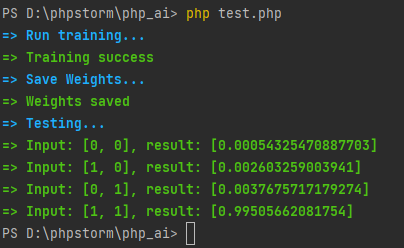
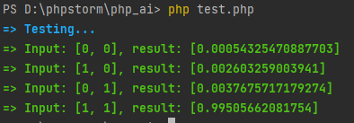

# PHP AI - Нейросеть на PHP
Пример реализации простой нейросети на PHP

Для примера класс сети реализован следующим образом:
имеется входной слой, промежуточный и выходной. Количество нейронов каждого слоя можно задать в конструкторе.

Можно попытаться изобразить логический оператор И, где принимаются 2 аргумента (0 или 1) и нейросеть выдает ответ.

## Запуск c обучением
``
$ php test.php
``
## Результат
````
=> Run training...
=> Training success
=> Save Weights...                             
=> Weights saved                               
=> Testing...                                  
=> Input: [0, 0], result: [0.00050500874055015]
=> Input: [1, 0], result: [0.0023971208568645] 
=> Input: [0, 1], result: [0.0034857253613739] 
=> Input: [1, 1], result: [0.99544824644645]  
````


Если закомментировать в файле примера блок обучения, то будет следеющий результат:
````
=> Testing...                                  
=> Input: [0, 0], result: [0.00050500874055015]
=> Input: [1, 0], result: [0.0023971208568645] 
=> Input: [0, 1], result: [0.0034857253613739] 
=> Input: [1, 1], result: [0.99544824644645]  
````


## Обучение
Для обучения используются датасеты с заранее известным значением результата. В данной сети используется обучение путем обратного распространения ошибки.

## Пример обучения для имитации логического оператора И
````php
// Создаем нейросеть
$nn = new NeuralNetwork(2, 3, 1, 'storage');
    
// Обучающий датасет
$trainingSet = [
    [[0, 0], [0]],
    [[0, 1], [0]],
    [[1, 0], [0]],
    [[1, 1], [1]],
];

// Количество "эпох"
$epochs = 100000;

// Скорость обучения
$learningRate = 0.5;

for ($i = 0; $i < $epochs; $i++) {
    // Выбираем случайный элемент из датасета
    $trainingData = $trainingSet[array_rand($trainingSet)];
    $inputs       = $trainingData[0];
    $targets      = $trainingData[1];
    $nn->train($inputs, $targets, $learningRate);
}

// Сохраняем натренированные веса
$nn->saveWeights();
````
Далее при уже обученной сети можно использовать значения сохраненных на этапе обучения весов (метод train() вызывать не требуется)